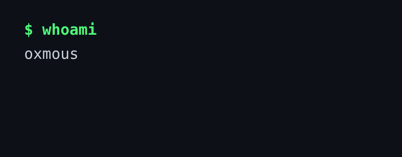
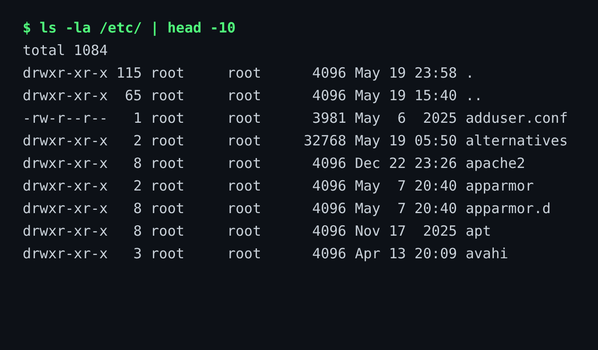
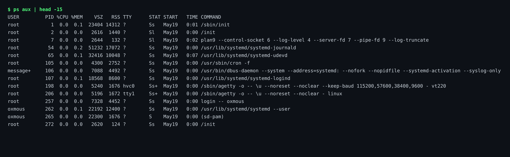
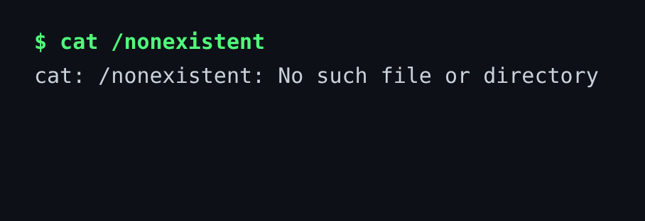

# ⚡ ShellCast

**Terminal session evidence recorder for pentesters.**

Record terminal sessions, search command history, and generate report-ready PNG screenshots — single binary, zero config.

> *"Never forget to screenshot again."*

---

## Screenshots

`shellcast shot 1` — whoami:



`shellcast shot 2` — ls -la:



`shellcast shot 4` — ps aux:



`shellcast shot 5` — error output:



---

## Install

### If you have Go:
```bash
go install github.com/0xmous27/shellcast/cmd/shellcast@latest
```

### If you don't have Go:
```bash
# Install Go
wget https://go.dev/dl/go1.24.4.linux-amd64.tar.gz
sudo tar -C /usr/local -xzf go1.24.4.linux-amd64.tar.gz
rm go1.24.4.linux-amd64.tar.gz

# Add to PATH (add these to ~/.bashrc or ~/.zshrc to make permanent)
export PATH=$PATH:/usr/local/go/bin
export PATH=$PATH:~/go/bin

# Install shellcast
go install github.com/0xmous27/shellcast/cmd/shellcast@latest

# Verify
shellcast version
```

### Requirements (Linux, for PNG screenshots):
```bash
sudo apt install chromium    # or google-chrome / chromium-browser
```

---

## Quick Start

```bash
# Record
shellcast start engagement-1

# Hack normally...
nmap -p- 10.10.10.5
sqlmap -u "http://target/page?id=1" --os-shell
#mark shell-access
whoami
#mark root
exit

# Review
shellcast show

# Generate evidence
shellcast shot 3
shellcast shot 4 -o root_proof.png
shellcast export > report.md
```

---

## Commands

| Command | Description |
|---------|-------------|
| `shellcast start <name>` | Start recording |
| `shellcast show [session-id]` | Command timeline |
| `shellcast highlights` | Auto-flagged security commands |
| `shellcast marks` | Bookmarked commands |
| `shellcast search <query>` | Search commands + output |
| `shellcast shot <id\|range>` | Generate PNG screenshot |
| `shellcast shot 3 -o file.png` | Custom output filename |
| `shellcast export` | Markdown report |
| `shellcast sessions` | List all sessions |
| `shellcast mark <id> [tag]` | Retroactive bookmark |
| `shellcast delete <session-id>` | Delete a session |
| `shellcast exclude add ">"` | Exclude pattern from output |
| `shellcast exclude list` | Show current exclude patterns |
| `shellcast exclude clear` | Remove all exclude patterns |
| `shellcast version` | Version |

**During session:**
```bash
#mark <tag>    # bookmarks the previous command (silent, no output)
```

---

## Exclude Patterns

Some terminals add extra characters (like `>`) to output that you don't want in your screenshots or reports. Use `exclude` to filter them out:

```bash
# Add a pattern to exclude
shellcast exclude add ">"

# Exclude your prompt if it leaks into output
shellcast exclude add "user@host"

# See what's excluded
shellcast exclude list

# Clear all patterns
shellcast exclude clear
```

Patterns are stored in `~/.shellcast/exclude` and apply to:
- `shellcast show` (clean text output)
- `shellcast shot` (PNG screenshots)
- `shellcast export` (markdown reports)

---

## How It Works

1. `shellcast start` spawns your shell in a PTY — fully transparent, no lag
2. Keystrokes are captured to reconstruct commands
3. Output is stored raw + cleaned (ANSI stripped)
4. `shellcast shot` renders clean output as terminal-styled PNG via headless Chromium
5. Everything persists in local SQLite

**No shell modification.** No hooks, no aliases, no `.bashrc` changes.

---

## PNG Screenshots

- Dark background (#0d1117)
- Monospace font (JetBrains Mono / Fira Code)
- Green `$ command` prompt
- 2x retina resolution
- Tight-cropped to content — no extra space
- Saved to current directory

---

## Auto-Highlighting

Flags commands containing:

`whoami` · `root` · `password` · `ssh` · `sqlmap` · `nuclei` · `linpeas` · `sudo` · `nmap` · `hashcat` · `hydra` · `meterpreter` · `dump` · `cred` · `bloodhound` · `mimikatz`

Ignores: `ls` · `cd` · `pwd` · `clear` · `history`

---

## Storage

```
~/.shellcast/shellcast.db    # SQLite — local only, no cloud
```

---

## Use Cases

- OSCP/CPTS exam reports
- Bug bounty proof of exploitation
- Red team engagement evidence
- CTF writeup screenshots
- Blog/Medium terminal screenshots

---

## Build from Source

```bash
git clone https://github.com/0xmous27/shellcast.git
cd shellcast
go build -o shellcast ./cmd/shellcast/
sudo mv shellcast /usr/local/bin/
```

---

## License

MIT — [@0xmous27](https://github.com/0xmous27)
